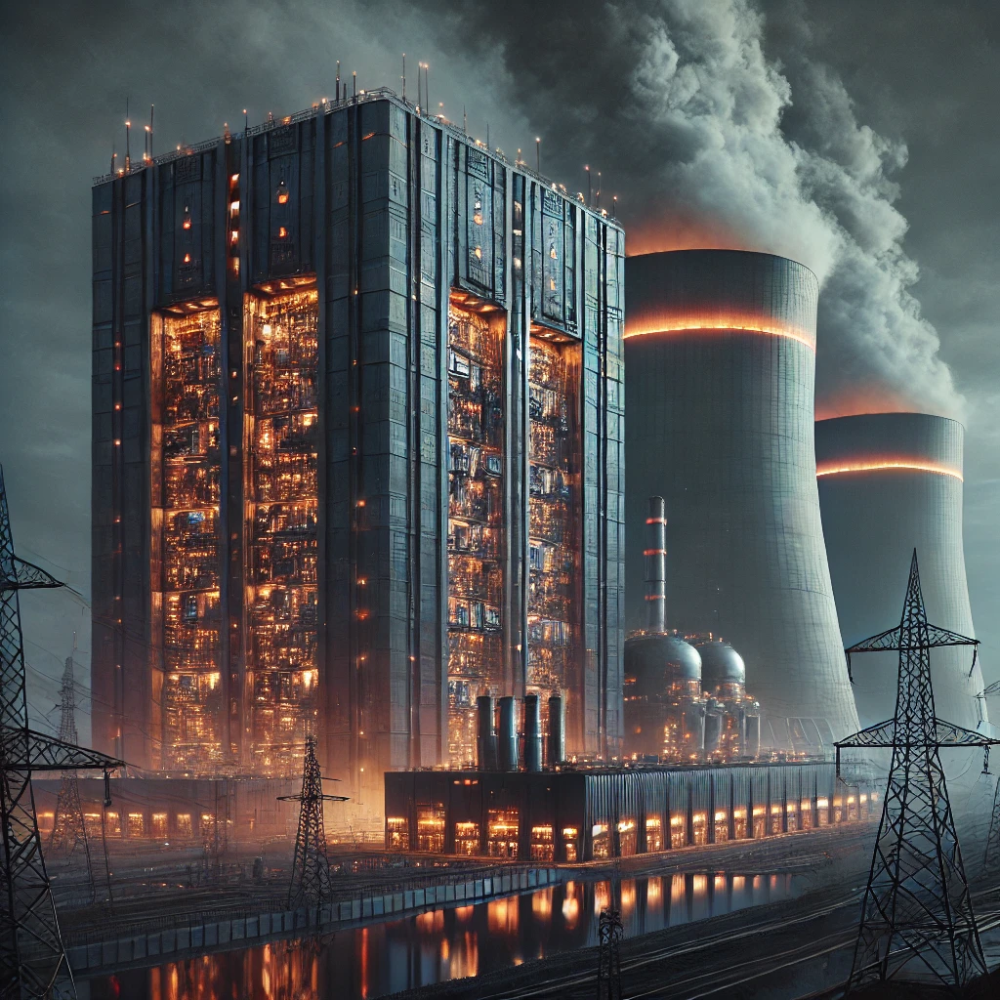

<div align="center">

```
 ██████╗ ███████╗███╗   ██╗███████╗██████╗  █████╗ ████████╗██╗██╗   ██╗███████╗ █████╗ ██╗
██╔════╝ ██╔════╝████╗  ██║██╔════╝██╔══██╗██╔══██╗╚══██╔══╝██║██║   ██║██╔════╝██╔══██╗██║
██║  ███╗█████╗  ██╔██╗ ██║█████╗  ██████╔╝███████║   ██║   ██║██║   ██║█████╗  ███████║██║
██║   ██║██╔══╝  ██║╚██╗██║██╔══╝  ██╔══██╗██╔══██║   ██║   ██║╚██╗ ██╔╝██╔══╝  ██╔══██║██║
╚██████╔╝███████╗██║ ╚████║███████╗██║  ██║██║  ██║   ██║   ██║ ╚████╔╝ ███████╗██║  ██║██║
 ╚═════╝ ╚══════╝╚═╝  ╚═══╝╚══════╝╚═╝  ╚═╝╚═╝  ╚═╝   ╚═╝   ╚═╝  ╚═══╝  ╚══════╝╚═╝  ╚═╝╚═╝
```
```
 ██████╗██╗   ██╗██████╗ ███████╗██████╗     ██████╗ ██╗      ██████╗  ██████╗██╗  ██╗ ██████╗██╗  ██╗ █████╗ ██╗███╗   ██╗
██╔════╝╚██╗ ██╔╝██╔══██╗██╔════╝██╔══██╗    ██╔══██╗██║     ██╔═══██╗██╔════╝██║ ██╔╝██╔════╝██║  ██║██╔══██╗██║████╗  ██║
██║      ╚████╔╝ ██████╔╝█████╗  ██████╔╝    ██████╔╝██║     ██║   ██║██║     █████╔╝ ██║     ███████║███████║██║██╔██╗ ██║
██║       ╚██╔╝  ██╔══██╗██╔══╝  ██╔══██╗    ██╔══██╗██║     ██║   ██║██║     ██╔═██╗ ██║     ██╔══██║██╔══██║██║██║╚██╗██║
╚██████╗   ██║   ██████╔╝███████╗██║  ██║    ██████╔╝███████╗╚██████╔╝╚██████╗██║  ██╗╚██████╗██║  ██║██║  ██║██║██║ ╚████║
 ╚═════╝   ╚═╝   ╚═════╝ ╚══════╝╚═╝  ╚═╝    ╚═════╝ ╚══════╝ ╚═════╝  ╚═════╝╚═╝  ╚═╝ ╚═════╝╚═╝  ╚═╝╚═╝  ╚═╝╚═╝╚═╝  ╚═══╝
```

[](https://git.io/typing-svg)

<br/>


&nbsp;
[](https://github.com/QuantGenAIPhr34kW1z?tab=followers)

</div>

---



### `> whoami`

```yaml
name: Martin
role: AI Engineer | Security Researcher | Blockchain Architect
focus:
  - Generative AI & LLM Systems
  - Offensive & Defensive Security
  - Smart Contracts & DeFi Protocols
  - Distributed Systems & Cryptography
philosophy: "Break it to understand it, build it to master it"
currently:
  training: Fine-tuning LLMs for specialized domains
  hacking: Red team engagements & vulnerability research
  building: Decentralized protocols & zero-knowledge systems
  exploring: The convergence of AI, security, and blockchain
```

<br clear="right"/>

---

## `// EXPERTISE DOMAINS`

<table>
<tr>
<td width="33%" valign="top">

### Artificial Intelligence
> *From neurons to intelligence*

- **Model Training** - Distributed training, hyperparameter tuning, MLOps
- **Fine-Tuning** - LoRA, QLoRA, PEFT, domain adaptation
- **Prompt Engineering** - Chain-of-thought, RAG, agentic systems
- **LLM Infrastructure** - Inference optimization, quantization, deployment

</td>
<td width="33%" valign="top">

### Cybersecurity
> *Offense informs defense*

- **Red Team Operations** - Adversary simulation, threat modeling
- **Penetration Testing** - Web, network, infrastructure exploitation
- **Security Hardening** - Zero-trust architecture, defense-in-depth
- **Audit & Compliance** - Vulnerability assessment, code review, SIEM

</td>
<td width="33%" valign="top">

### Blockchain & Web3
> *Trustless, decentralized, immutable*

- **Smart Contracts** - Solidity, Vyper, formal verification
- **DeFi Protocols** - AMMs, lending, yield optimization
- **Layer 1 & 2** - Consensus mechanisms, rollups, bridges
- **Cryptographic Primitives** - ZK-proofs, MPC, threshold signatures

</td>
</tr>
<tr>
<td width="33%" valign="top">

### Systems & Infrastructure
> *Low-level mastery, high-level vision*

- **Kernel & OS Development** - Linux internals, syscalls, eBPF
- **Network Engineering** - Mesh VPNs, overlay networks, protocol design
- **Distributed Systems** - Consensus algorithms, fault tolerance
- **Virtualization** - Hypervisors, containers, orchestration

</td>
<td width="33%" valign="top">

### Data Engineering
> *Petabyte-scale pipelines*

- **Stream Processing** - Real-time analytics, event-driven architecture
- **Data Lakes** - Schema evolution, partitioning, lakehouse design
- **ETL at Scale** - Batch processing, data quality, lineage tracking
- **Scientific Computing** - Numerical methods, HPC, simulations

</td>
<td width="33%" valign="top">

### DevSecOps
> *Ship fast, ship secure*

- **CI/CD Pipelines** - GitOps, automated testing, blue-green deploys
- **Container Security** - Image scanning, runtime protection, SBOM
- **Infrastructure as Code** - Terraform, Pulumi, immutable infra
- **Observability** - Distributed tracing, metrics, log aggregation

</td>
</tr>
</table>

---

## `// TECHNICAL ARSENAL`

<details open>
<summary><b>AI & MACHINE LEARNING</b> - <i>Training, fine-tuning, deploying intelligence</i></summary>
<br/>


</details>

<details open>
<summary><b>CYBERSECURITY</b> - <i>Red team, blue team, purple team</i></summary>
<br/>


</details>

<details open>
<summary><b>BLOCKCHAIN & WEB3</b> - <i>Decentralized, trustless, immutable</i></summary>
<br/>


</details>

<details>
<summary><b>SYSTEMS PROGRAMMING</b> - <i>Where performance meets precision</i></summary>
<br/>


</details>

<details>
<summary><b>FUNCTIONAL & CONCURRENT</b> - <i>Elegance in parallelism</i></summary>
<br/>


</details>

<details>
<summary><b>DATA SCIENCE & ANALYTICS</b> - <i>From raw data to insights</i></summary>
<br/>


</details>

<details>
<summary><b>BIG DATA & STREAMING</b> - <i>Petabyte-scale processing</i></summary>
<br/>


</details>

<details>
<summary><b>DATABASES</b> - <i>Persistence engineered</i></summary>
<br/>


</details>

<details>
<summary><b>CLOUD & ORCHESTRATION</b> - <i>Infrastructure as code</i></summary>
<br/>


</details>

<details>
<summary><b>OBSERVABILITY & CI/CD</b> - <i>Visibility into chaos</i></summary>
<br/>


</details>

<details>
<summary><b>NETWORKING & MESSAGING</b> - <i>Protocols and patterns</i></summary>
<br/>


</details>

<details>
<summary><b>EMBEDDED & IoT</b> - <i>Hardware meets software</i></summary>
<br/>


</details>

<details>
<summary><b>DEVELOPMENT ENVIRONMENT</b> - <i>Tools of the trade</i></summary>
<br/>


</details>

---

## `// METRICS`

<div align="center">


<br/><br/>


<br/><br/>


</div>

---

## `// CONTRIBUTIONS`

<div align="center">


</div>

---

## `// ACHIEVEMENTS`

<div align="center">


</div>

---

<div align="center">

### `> echo $PHILOSOPHY`

```
┌─────────────────────────────────────────────────────────────────────────────┐
│                                                                             │
│   "In the quantum realm of software, we exist in superposition-             │
│    simultaneously architects and artists, engineers and explorers.          │
│    Every commit collapses possibility into reality."                        │
│                                                                             │
│                                              - mirabile futurum             │
│                                                                             │
└─────────────────────────────────────────────────────────────────────────────┘
```

<br/>


</div>
